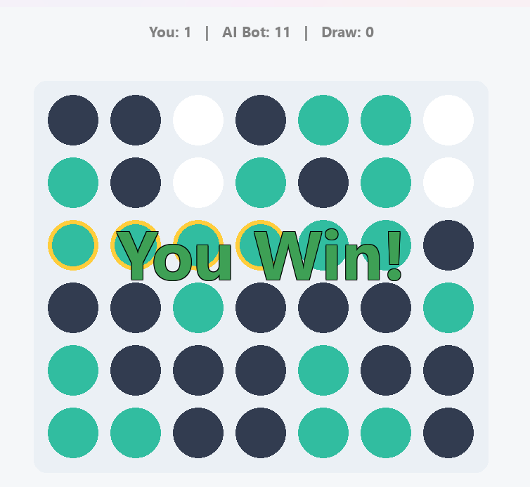
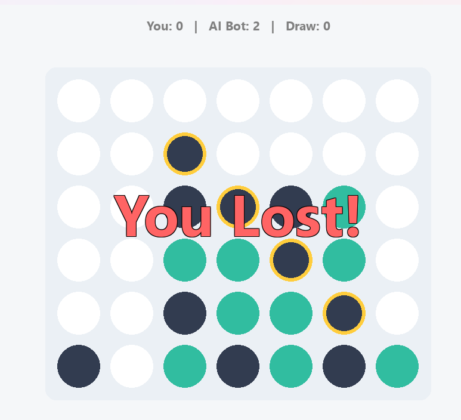

# Connect 4 – Python GUI with MCTS AI

A **Connect 4 game** implemented in Python with a GUI and AI opponent using the **Monte Carlo Tree Search (MCTS)** algorithm.  

---

## 🚀 Features
- Play against a smart AI powered by MCTS.  
- Graphical interface using **pygame**.  
- Tracks scores: Wins, Losses, Draws.  
- Highlight winning moves.  
- Smooth animations for piece drops.  
- Easy to run – just open and play!  

---

## 🛠️ Requirements
- Python 3.x  
- **pygame** library  
  Install pygame using:  
  ```bash
  pip install pygame

---

## ⚡ How to Run
1. Clone or download this repository.  
2. Make sure `pygame` is installed .  
3. Open the project folder.  
4. Run the game:  
   - On **Windows**: double-click `GUI.py`  
   - Or, in a terminal/command prompt:  
     ```bash
     python GUI.py
     ```  
5. The game window will open – play as **You** against the AI Bot!  

---

## 🎮 Controls
- Click on a column to drop your piece.  
- The AI will automatically play its turn.  
- The game tracks wins, losses, and draws automatically.  
- Winning combination is highlighted on the board.  

---

## 🗂️ Project Structure
- `GUI.py` – user interface, game flow, rendering
- `MCTS.py` – game state and AI logic

---

## 📝 What I Learned
- Implementing AI with Monte Carlo Tree Search.
- GUI programming in Python using pygame.
- Handling game logic and animations.
- Board game design and player interaction.

---

## 👩‍💻 Author
**Menna Adel**

---
## 📸 Images





